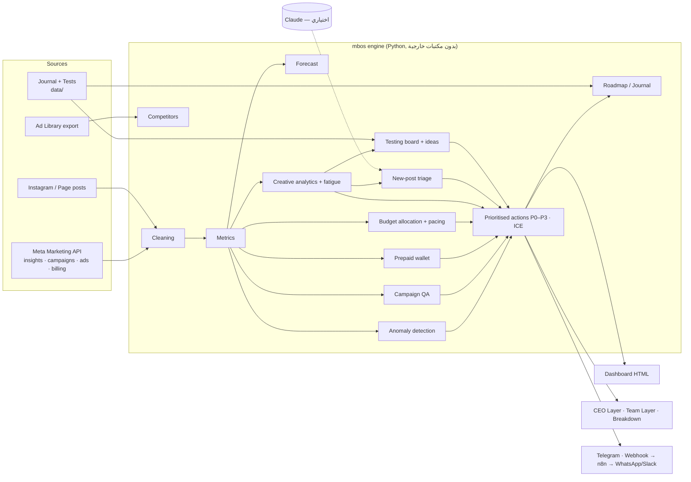

# MB — Media Buying OS

سيستم واحد لإدارة **7 أكونتات Meta** (وقابل لإضافة TikTok / Snapchat / Google) بيعمل شغل فريق كامل جوه كل أكونت:
مراقبة يومية، كشف المشاكل، QA، ميزانيات، محفظة الدفع المسبق، تحليل الكريتيف، تقييم أي بوست جديد، نظام اختبارات، منافسين، توقعات، وتقارير للإدارة وللفريق — ومعاها سجل (Roadmap/Journal) لكل اللي حصل في كل أكونت.

الهدف: **الـ Breakdown اليومي لكل الأكونتات في أقل من 10 دقايق، والشغل اليومي كله في ساعة لساعتين.**



## تجربة سريعة (من غير أي توكن)

```bash
python3 -m mbos run --demo --no-notify
# افتح output/dashboard.html
```

الـ demo فيه 7 أكونتات وهمية، كل واحد فيه سيناريو (أكونت سليم، إرهاق كريتيف، CPM طالع، **مديونية**، رصيد بيخلص، تراكينج واقع، إعلان مرفوض + Learning Limited) عشان تشوف كل موديول شغال.

## التشغيل على الأكونتات الحقيقية

1. `cp config/accounts.example.json config/accounts.json` واملأ بيانات كل أكونت. **أهم حاجة: `business`** (الهدف، AOV، الهامش، التارجت CPA، الميزانية الشهرية) — السيستم بيحكم على كل رقم بالنسبة لاقتصاديات البيزنس مش بأرقام عامة.
2. `export META_ACCESS_TOKEN=...` (System User token — الخطوات في [docs/SETUP.md](docs/SETUP.md)).
3. `python3 -m mbos run`
4. جدولة: [n8n/](n8n/) أو [n8n/crontab.example](n8n/crontab.example).

| الأمر | بيعمل إيه | التوقيت المقترح |
|---|---|---|
| `python3 -m mbos run` | الداشبورد + Breakdown + CEO + Team + Roadmap، ويبعت الملخص على Telegram/Webhook | يومياً 8 الصبح |
| `python3 -m mbos alerts --kind prepaid` | تنبيه الرصيد قبل ما يخلص (بيتبعت مرة واحدة لكل حالة) | كل ساعة |
| `python3 -m mbos alerts --kind posts` | أي بوست جديد: تقييم + قرار (إعلان في كامبين موجودة / اختبار / عضوي) | كل 30 دقيقة |
| `python3 -m mbos alerts --kind anomaly` | أي anomaly حرجة | 3 مرات في اليوم |
| `python3 -m mbos apply-spend-caps --yes` | يكتب الـ Spending limit المقترح على كل أكونت (حماية من المديونية) | بعد كل شحن |

## المخرجات

| الملف | لمين |
|---|---|
| `output/dashboard.html` | الداشبورد: القيادة · الأكونت · المحفظة · الكريتيف · الاختبارات · CEO · الفريق · Roadmap |
| `output/breakdown.md` | الـ Breakdown اليومي (دقيقة لكل أكونت) |
| `output/ceo.md` | **CEO Layer:** ملخص + قرارات مطلوبة + مخاطر + أولويات |
| `output/team.md` | **Team Layer:** المهمة · إزاي · المسؤول · الأداة · الموعد · KPI · ICE + insights للفريق الإبداعي |
| `output/roadmap.md` | Roadmap + Timeline لكل أكونت (Mermaid) — اللي نجح، اللي أثّر بالسلب، فاضل إيه |
| `output/results.json` | كل الداتا (لـ n8n / Looker Studio / Sheets) |

## الوثائق

- [docs/SYSTEM.md](docs/SYSTEM.md) — المعمارية، إزاي كل موديول بيفكر، و"الفريق" اللي السيستم بيغطيه (وإيه اللي لسه Phase 2)
- [docs/PLAYBOOKS.md](docs/PLAYBOOKS.md) — روتين الـ 10 دقايق، مشكلة الدفع المسبق والمديونية، Creative Testing System، مسار البوست الجديد، الـ Naming convention
- [docs/SETUP.md](docs/SETUP.md) — Meta token، Telegram، n8n، Claude

## الاختبارات

```bash
python3 -m unittest discover -s tests -t .
```
