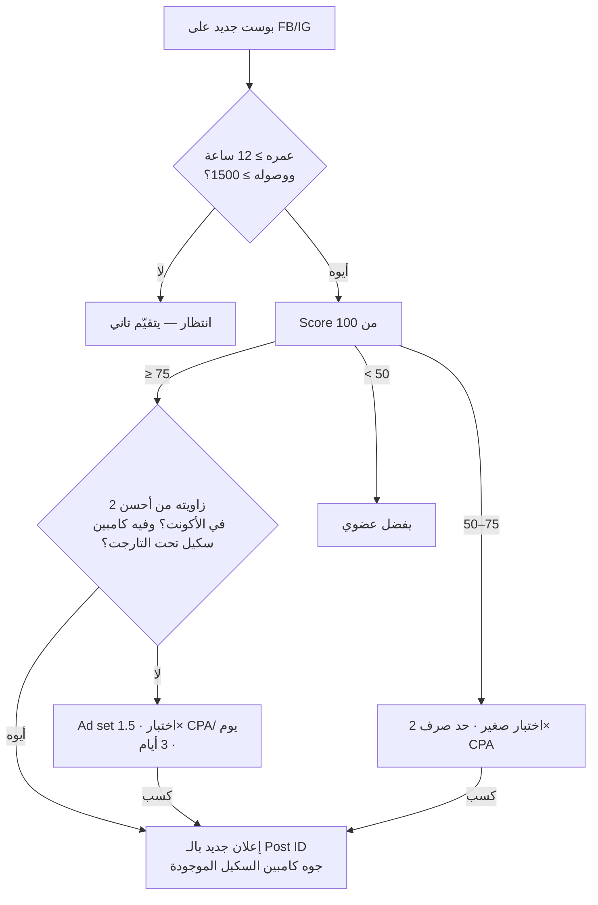

# Playbooks

## 1. روتين اليوم (ساعة لساعتين)

| الوقت | المدة | إيه |
|---|---|---|
| 08:00 | تلقائي | `mbos run` بيبعت الـ Breakdown على Telegram/WhatsApp |
| 09:00 | **10 دقايق** | الـ Breakdown: P0 الأول، وبعدها أكونت أكونت من الأضعف للأقوى (60–80 ثانية لكل أكونت: Health · CPR مقابل التارجت · الرصيد · أهم 3 قرارات) |
| 09:10 | 30–45 دقيقة | تنفيذ P0 و P1 من تبويب **الفريق** (فلتر على دورك) |
| 09:55 | 15 دقيقة | تبويب **الكريتيف**: البوستات الجديدة اللي "تستحق إعلان" + Insights → تتبعت للمصمم |
| 10:10 | 10 دقايق | تبويب **الاختبارات**: اقفل الكسبان/الخسران، سجّل النتيجة في الـ Journal |
| خلال اليوم | تلقائي | تنبيهات الرصيد (كل ساعة)، البوستات (كل 30 دقيقة)، الـ anomalies (3 مرات) |
| الأحد | 30 دقيقة | CEO Layer للإدارة + تحديث الـ Roadmap |

**قاعدة:** لو الأكونت "سليم" ومفيش P0/P1 — متلمسوش. أكتر حاجة بتبوّظ الأكونتات هي التعديل اليومي من غير سبب.

## 2. الدفع المسبق والمديونية

**ليه بيحصل:** ميتا بتحاسب على التوصيل بتأخير، والميزانية اليومية هدف مش سقف صارم (ممكن تصرف لحد 75% فوقها في يوم). فالأكونت ممكن يوصّل بعد ما الرصيد يخلص ويدخل مديونية، وبعدها الإعلانات بتقف لحد السداد والـ learning بيتأثر.

**الحل على 3 طبقات:**

1. **إنذار مبكر** (`alerts --kind prepaid` كل ساعة): Runway = الرصيد ÷ الحرق اليومي. الحرق = الأعلى بين متوسط صرف آخر 3 أيام ومجموع الميزانيات اليومية الشغالة (تقدير متحفظ).
   - 🟡 أقل من 3 أيام: جدول شحن · 🔴 أقل من يوم ونص: اشحن النهارده · ⛔ مديونية: سدّد + اشحن
   - الشحن المقترح يغطي 7 أيام (`target_cover_days`)، والتاريخ فيه يوم lead time للتحويل.
2. **Spending limit (الأهم ضد المديونية):** الحد في ميتا **تراكمي** على مدى عمر الأكونت. المقترح = المصروف لحد دلوقتي + الرصيد − نص يوم صرف. كده الأكونت يقف قبل ما الفلوس تخلص بدل ما يدخل مديونية. تطبيقه: `python3 -m mbos apply-spend-caps --yes` بعد كل شحن (أو يدوي من Billing).
   - العيب: لازم يتحدّث بعد كل شحن، وإلا الأكونت هيقف وفيه رصيد. عشان كده الأمر بيتشغل بعد الشحن مش على جدول.
3. **منع السكيل:** موديول الميزانية بيحوّل أي "زوّد" لـ "ثبّت" لو الرصيد أقل من 3 أيام.

**على مستوى الإدارة:** تبويب المحفظة + CEO Layer بيطلعوا "سيولة الشحن المطلوبة خلال 7 أيام" لكل الأكونتات، عشان الشحن يتخطط مرة واحدة في الأسبوع بدل ما يبقى طوارئ كل يوم.

## 3. Creative Testing System

**القاعدة:** اختبار = فرضية واحدة + متغير واحد + معايير نجاح وفشل مكتوبة **قبل** الإطلاق.

1. اكتب الاختبار في `data/tests/<CODE>.json` (شكله في `data/tests/EXAMPLE.json`): `hypothesis`, `variable` (Hook / Angle / Format / Offer / Audience)، `primary_kpi`, `success`, `failure`.
2. الإعلانات بتتربط بالاختبار بـ `T:<id>` في الاسم.
3. الهيكل: كامبين `<CODE>_TEST_ABO_...`، كل اختبار في ad set لوحده، ميزانية 1.5–2× التارجت CPA في اليوم، 3–5 variants.
4. الحكم التلقائي (`config/settings.json → testing`):
   - **Winner:** ≥ 5 نتائج و CPR ≤ 0.9× التارجت → يتنقل لكامبين السكيل **بنفس الـ Post ID** (عشان التفاعل يفضل)
   - **Loser:** صرف 2× التارجت بدون نتيجة، أو CPR ≥ 1.5× بعد صرف 3×
   - **Inconclusive:** عدّى 10 أيام
5. سجّل النتيجة كحدث في الـ Journal (الكسبان بيتسجل لوحده).

**أولوية الاختبار:** Angle الأول (أكبر تأثير)، بعدها Hook، بعدها Format. تغيير الفورمات بس لزاوية خسرانة نادراً ما بيقلب النتيجة.

## 4. مسار البوست الجديد



**تحذير:** الأداء العضوي مؤشر مش دليل. بوست بتفاعل عالي من الفولورز ممكن يفشل مع جمهور بارد. عشان كده حتى الـ Score العالي بيروح اختبار إلا لو زاويته اتثبتت قبل كده في الأكونت.

لو `ANTHROPIC_API_KEY` موجود، Claude بيحلل كل بوست جديد (الهوك، الزاوية، العرض، الاعتراضات، مرحلة الفانل، أهم تعديل قبل ما يتحول لإعلان) والتحليل بيظهر في كارت البوست.

## 5. Naming convention

**من جوه الأد أكونت:** Ads Manager فيه **Naming templates** (وانت بتسمّي الكامبين/الإد ست/الإعلان → "Create name template"). بيبني الاسم أوتوماتيك من حقول زي الهدف والتاريخ والجمهور، وتقدر تضيف حقول نص حرة. ده بيحل أسماء الكامبين والإد ست. الزاوية والهوك مش حقول في ميتا، فلازم يتكتبوا كنص حر في اسم الإعلان.

**لو الفريق مش هيلتزم:** السيستم بيصنّف الإعلانات اللي من غير tags بـ Claude من نص الإعلان (`data/tags/`). ده تقدير من النص، مش من الفيديو. الـ naming اليدوي أدق وبيكسب لو الاتنين موجودين.

السيستم بيقرا الأسماء دي:

**الكامبين:** `<CODE>_<ROLE>_<TYPE>_<Objective>_<Audience>`
- ROLE: `SCALE` · `TEST` · `RT` · `PROS`
- مثال: `NOVA_SCALE_CBO_Purchase_Broad` · `NOVA_TEST_ABO_Creative` · `NOVA_RT_CBO_Purchase_30D`

**الإعلان:** توكنز مفصولة بـ `|`
```
F:UGC | A:Pain | H:Question | O:FreeShip | T:T012 | v2
```
| التوكن | المعنى | قيم مقترحة |
|---|---|---|
| `F:` | Format | UGC, Static, Carousel, Video, Founder, Demo, Testimonial |
| `A:` | Angle | Pain, Desire, SocialProof, Offer, Transformation, Demo, Education, Comparison, Objection, Urgency |
| `H:` | Hook type | Question, Bold, Result, POV, Price, Problem, Story |
| `O:` | Offer | FreeShip, 20Off, Bundle, Gift, None |
| `T:` | Test ID | T012 |
| `P:` | Persona | Moms, Students, ... |

Format ≠ Angle: "UGC" فورمات، "Pain" زاوية. ممكن UGC بزاوية Pain أو بزاوية SocialProof — وده بالظبط اللي بنختبره.
